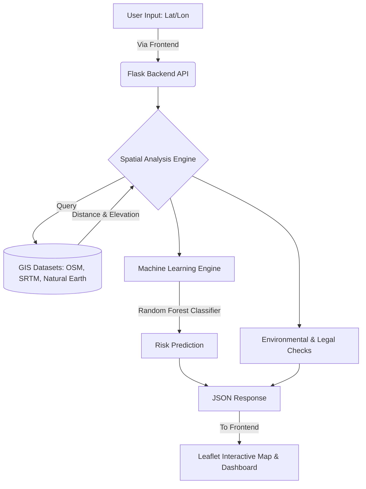

# 🌍 GeoSafe AI - Smart Land Analyzer (AI + ML + GIS)

Welcome to **GeoSafe AI**, an intelligent geospatial analysis system designed to evaluate land safety using **GIS datasets + Machine Learning**. Our system is built to provide clear, explainable, and real-time insights through a highly interactive map interface.

Whether you're an urban planner, environmentalist, or an open-source contributor, this guide will help you understand how our tool works and how to set it up quickly!

---

## 🚀 Features

* 📍 **Smart Location Search**: Accepts latitude & longitude input for precise analysis.
* 🌍 **Comprehensive GIS Analysis**: Multi-layer spatial validation using real-world GIS data.
* 🌊 **Water Body Detection**: Accurately detects ocean, lakes, rivers, and coastal zones.
* 🌳 **Environmental Awareness**: Identifies forest regions and eco-sensitive areas.
* 🤖 **AI-Driven Assessment**: Machine Learning-based risk prediction with ~90% accuracy.
* ⚠️ **Risk Identification**: Highlights environmental and legal risks in real-time.
* 🗺️ **Visual Context**: Interactive map with real-time land-use context overlays.
* 📊 **Modern Dashboard**: Clean, responsive, and intuitive UI.

---

## 🧠 System Architecture & Workflow

Here is how data flows through GeoSafe AI to bring you actionable intelligence.



### ⚙️ How It Works (Step-by-Step)
1. **User Request**: You input a specific land coordinate (Latitude & Longitude).
2. **Spatial Feature Extraction**: The backend checks GIS datasets (Natural Earth, OSM, SRTM) to compute spatial metrics (distance to rivers, forests, oceans, elevation, etc.).
3. **ML Prediction**: These spatial metrics are fed into our Pre-Trained Random Forest Classifier.
4. **Logic Rules**: Hardcoded spatial logic checks for restricted zones (e.g., inside oceans, critical forests).
5. **Insights Displayed**: The frontend visualizes the location, surrounding neighborhood, and safety classification on an interactive map.

### 🎯 Dynamic Purpose Analysis
The system intelligently adapts its recommendations based on the **"Purpose"** you select from the dropdown (General, Residential, Industrial, Farming):
* **Compatibility Check**: The AI cross-references your selected purpose with the 5km geographic surroundings. For example, trying to validate land for "Industrial" use in an area that is dominantly 80% "Farming" will trigger an AI context warning.
* **Smart Overrides**: Safety always comes first. If "Residential" is chosen inside a restricted government zone (like a coastline, river buffer, or public highway), the system overrides the ML model and strictly forces the Risk Level to **High**.

---

## 📊 Risk Classification

| Risk Level | Meaning | Actionable Insight |
| ---------- | ------- | ------------------ |
| 🟢 **Low** | Safe land | Ideal for development or agriculture. |
| 🟡 **Medium** | Moderate risk | Potential environmental constraints exist. |
| 🔴 **High** | Unsafe / restricted | Prohibited zones (e.g., in water bodies or deep forests). |

---

## 🖥️ Tech Stack

**Backend & Data Processing**
* Python (Flask API)
* GeoPandas, Shapely, Rasterio
* Scikit-learn (Random Forest)

**Frontend & Visualization**
* Vanilla JavaScript (Leaflet.js)
* HTML5, CSS3

---

## ▶️ Getting Started

Follow these steps to run the project locally.

### 1️⃣ Install Dependencies

Ensure you have Python installed, then install the required packages:
```bash
pip install flask geopandas shapely rasterio pandas numpy scikit-learn flask-cors joblib
```

### 2️⃣ Generate the Dataset & Train the ML Model

The ML model needs to be trained on realistic geographical data before running the server.
```bash
cd backend/ML

# Generate artificial but realistic spatial dataset
python generate_data.py

# Train the Random Forest Classifier
python train_model.py
```

### 3️⃣ Run the Backend Server

Start the Flask API to process requests (make sure to return to the `backend` root folder):
```bash
cd ..
python app.py
```

### 4️⃣ Open the Frontend Application

With the backend running, just open the `frontend/index.html` file in any modern web browser to use the interface!

---

## ⚡ Technical Optimizations

We've optimized GeoSafe AI to be highly responsive and memory-efficient:
* **Spatial Indexing (R-tree)**: Enables extremely fast GIS queries and bounding-box intersections.
* **Smart Data Loading**: Uses optimized dataset bounding box queries to avoid loading massive shapefiles into memory.
* **Parallel ML Training**: Uses multiple CPU cores (`n_jobs=-1`) for fast Random Forest training.
* **CRS Transformation**: Ensures precise and accurate distance calculation globally.

---

## 👨‍💻 Authors

* **Abdul Sami**
* **Thrivikram**
* **Leela Yashwanth**
* **Mohammad Samiullah**

---

## ⭐ Support Us
If you find this project useful or interesting, don't forget to **Star** this repository!
