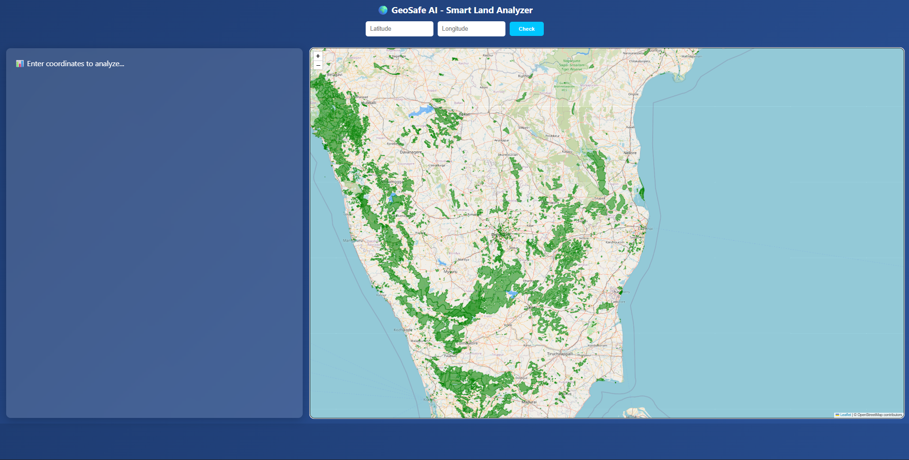
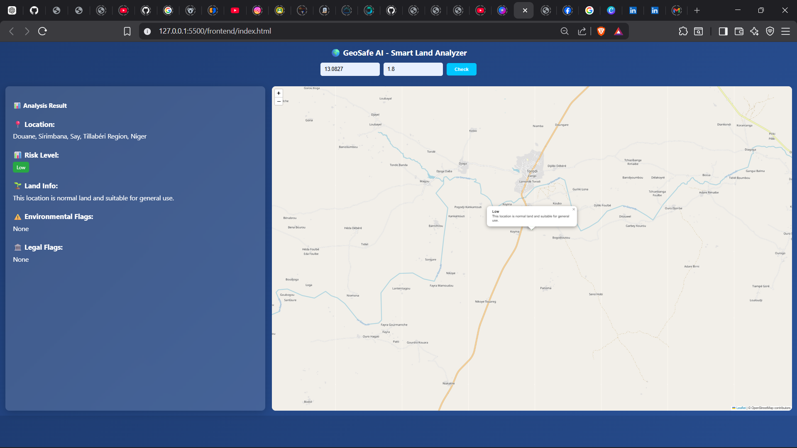

# 🌍 GeoSafe AI - Smart Land Analyzer (AI + ML + GIS)

GeoSafe AI is an intelligent geospatial analysis system that evaluates land safety using **GIS datasets + Machine Learning** and provides clear, explainable insights through an interactive map interface.

---

## 🚀 Features

* 📍 Accepts latitude & longitude input
* 🌍 Multi-layer spatial validation using GIS data
* 🌊 Detects ocean, lakes, rivers, and coastal zones
* 🌳 Identifies forest and eco-sensitive areas
* 🤖 Machine Learning-based risk prediction
* ⚠️ Highlights environmental and legal risks
* 🗺️ Interactive map with real-time overlays
* 📊 Clean and modern dashboard UI

---

## 🧠 How It Works

* Natural Earth dataset → land, ocean, lakes, coastline
* OSM data → forest regions
* SRTM data → elevation
* GeoPandas + Shapely → spatial analysis
* Machine Learning → risk prediction
* Flask → backend API
* Leaflet.js → map visualization

---

## 🤖 Machine Learning

* Model: Random Forest Classifier

* Features used:

  * Distance to river
  * Distance to lake
  * Distance to ocean
  * Distance to forest
  * Elevation
  * Slope

* Accuracy: ~90% (realistic model)

---

## 📊 Risk Classification

| Risk Level | Meaning             |
| ---------- | ------------------- |
| 🟢 Low     | Safe land           |
| 🟡 Medium  | Moderate risk       |
| 🔴 High    | Unsafe / restricted |

---

## 🖥️ Tech Stack

* Python (Flask)
* GeoPandas
* Shapely
* Rasterio
* Scikit-learn
* JavaScript (Leaflet)
* HTML + CSS

---

## ⚡ Optimization

* Spatial Indexing (R-tree) → fast GIS queries
* CRS transformation → accurate distance calculation
* Parallel ML training (`n_jobs=-1`)
* Balanced dataset generation

---

## ▶️ How to Run

### Install dependencies

```bash
pip install flask geopandas shapely rasterio pandas numpy scikit-learn flask-cors joblib
```

### Generate dataset (ML)

```bash
cd backend/ML
python generate_data.py
```

### Train model

```bash
python train_model.py
```

### Run backend

```bash
cd ..
python app.py
```

### Open frontend

Open `frontend/index.html` in browser

---

## 📸 Screenshots

### 🌍 Map View



### 📊 Result Panel



---

## 🎯 Key Highlights

* Real-time GIS analysis
* Machine Learning-based prediction
* Explainable output
* Interactive visualization
* Clean UI

---

## 👨‍💻 Author

Abdul Sami

Thrivikram

---

## ⭐ Star this repo if you like it!
