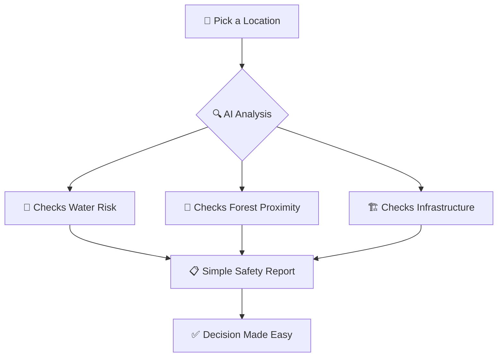
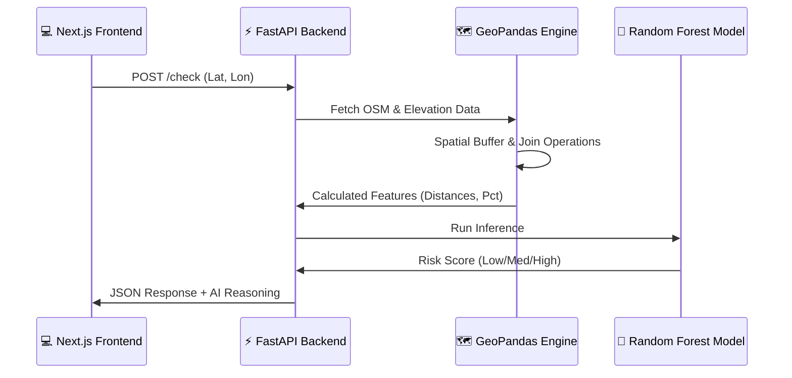

# 🌍 GeoSafe AI — Premium Land Intelligence Platform

> **Transforming Complex Spatial Data into Actionable Safety Insights.**

GeoSafe AI is a state-of-the-art spatial intelligence platform designed to evaluate land safety, environmental risks, and developmental suitability. By combining **OpenStreetMap (GIS) data**, **High-Resolution Elevation Models**, and **Machine Learning**, it provides users with a comprehensive "Risk Score" and plain-English explanations for any coordinate on Earth.

---

## 📊 System Workflows

### 🛡️ For Everyone (Non-Technical Flow)
*Understanding how GeoSafe AI helps you make safer decisions.*



### ⚙️ Under the Hood (Technical Pipeline)
*The architecture powering our spatial intelligence.*



---

## ✨ Key Features

- **🎯 Precision Analysis**: Evaluates land against multiple layers (Water, Roads, Forests, Industrial zones).
- **🧠 ML-Powered Risk Scoring**: Uses a Random Forest classifier trained on thousands of spatial data points.
- **⛰️ Terrain Awareness**: Integrates elevation data to determine if a site is a Plain, Hill, or Mountain.
- **🛰️ Real-Time OSM Integration**: Live extraction of building density and road networks.
- **📝 Human-Centric Insights**: Automatically generates clear explanations (e.g., *"Suitable for residential use, but close to a flood zone"*).

---

## 🛠️ Tech Stack

| Layer | Technology | Purpose |
| :--- | :--- | :--- |
| **Frontend** |  | High-performance dashboard |
| **Backend** |  | Async AI & GIS API |
| **Spatial** |  | Vector data processing |
| **ML Engine** |  | Risk prediction model |
| **Mapping** |  | Interactive map UI |

---

## 🚀 Getting Started

### The Quick Start (Windows)
We've automated the setup for you. Just run:
```powershell
.\start.bat
```
*This will automatically install dependencies and launch both the backend (Port 8000) and frontend (Port 3000).*

### Manual Setup

#### 1. Backend (FastAPI)
```bash
cd backend
pip install -r requirements.txt
uvicorn app:app --reload
```

#### 2. Frontend (Next.js)
```bash
cd frontend
npm install
npm run dev
```

---

## 📂 Project Structure

```text
GeoSafe-AI/
├── 📂 backend/           # FastAPI, ML Models, GIS Logic
│   ├── 📂 ML/            # Trained models & training scripts
│   ├── 📂 data/          # GeoJSON/Shapefiles (GIS data)
│   └── app.py            # Main API Entry
├── 📂 frontend/          # Next.js 14 Application
│   ├── 📂 src/app/       # Routes & Pages
│   └── 📂 src/components/# UI Components (Maps, Navbar)
└── start.bat             # One-click launch script
```

---

## 👥 The Team
- **Abdul Sami**
- **Thrivikram**
- **Leela Yashwanth**
- **Mohammad Samiullah**

---
<p align="center">Built with ❤️ for a Safer Planet.</p>
