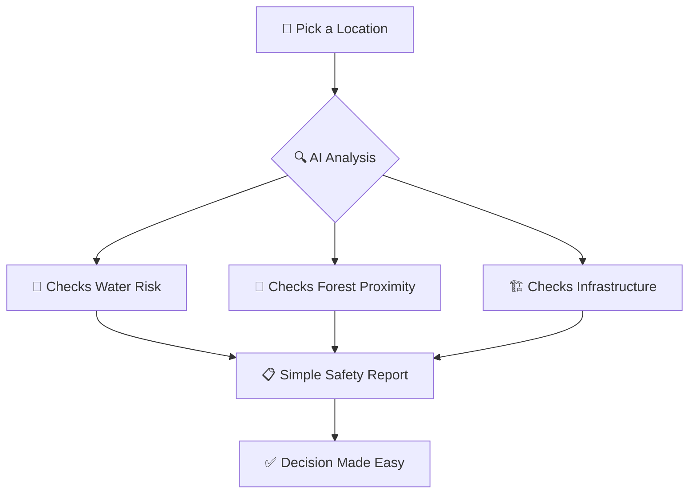
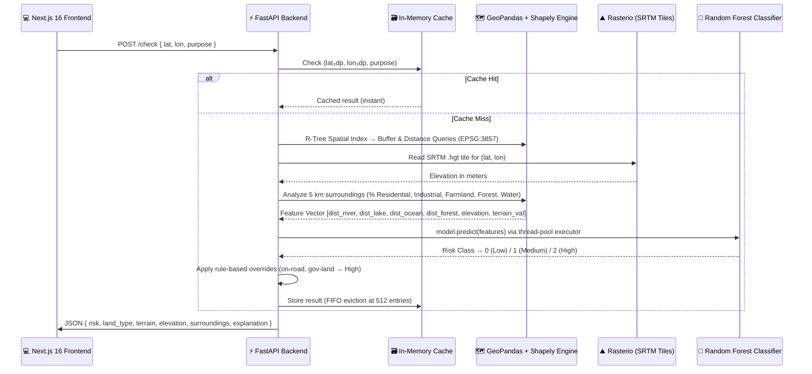

# 🌍 GeoSafe AI — Smart Land Safety Analyzer

> **Transforming Complex Spatial Data into Actionable Safety Insights.**

GeoSafe AI is a spatial intelligence platform that evaluates land safety, environmental risks, and developmental suitability for any coordinate. It combines **Natural Earth GIS data**, **OpenStreetMap shapefiles**, **SRTM Elevation Models**, and a **Random Forest ML classifier** to produce a risk score (Low / Medium / High) along with plain-English explanations.

---

## 📊 System Workflows

### 🛡️ For Everyone (Non-Technical Flow)
*Understanding how GeoSafe AI helps you make safer decisions.*


```mermaid
graph TD
    A[📍 Pick a Location] --> B{🔍 AI Analysis}
    B --> C[🌊 Checks Water Risk]
    B --> D[🌲 Checks Forest Proximity]
    B --> E[🏗️ Checks Infrastructure]
    C & D & E --> F[📋 Simple Safety Report]
    F --> G[✅ Decision Made Easy]
```

### ⚙️ Under the Hood (Technical Pipeline)
*The architecture powering our spatial intelligence.*


```mermaid
sequenceDiagram
    participant User as 💻 Next.js 16 Frontend
    participant API as ⚡ FastAPI Backend
    participant Cache as 🗃️ In-Memory Cache
    participant GIS as 🗺️ GeoPandas + Shapely Engine
    participant ELV as ⛰️ Rasterio (SRTM Tiles)
    participant ML as 🧠 Random Forest Classifier

    User->>API: POST /check { lat, lon, purpose }
    API->>Cache: Check (lat₃dp, lon₃dp, purpose)
    alt Cache Hit
        Cache-->>API: Cached result (instant)
    else Cache Miss
        API->>GIS: R-Tree Spatial Index → Buffer & Distance Queries (EPSG:3857)
        API->>ELV: Read SRTM .hgt tile for (lat, lon)
        ELV-->>API: Elevation in meters
        API->>GIS: Analyze 5 km surroundings (% Residential, Industrial, Farmland, Forest, Water)
        GIS-->>API: Feature Vector [dist_river, dist_lake, dist_ocean, dist_forest, elevation, terrain_val]
        API->>ML: model.predict(features) via thread-pool executor
        ML-->>API: Risk Class → 0 (Low) / 1 (Medium) / 2 (High)
        API->>API: Apply rule-based overrides (on-road, gov-land → High)
        API->>Cache: Store result (FIFO eviction at 512 entries)
    end
    API->>User: JSON { risk, land_type, terrain, elevation, surroundings, explanation }
```

---

## ✨ Key Features

| Feature | Description |
| :--- | :--- |
| **🎯 Precision Analysis** | Evaluates land against multiple spatial layers — Ocean, Lakes, Rivers, Coast, Forest, Farmland, Residential, and Industrial zones. |
| **🧠 ML-Powered Risk Scoring** | Random Forest classifier (200 trees, max depth 12) trained on 6 000 synthetic spatial data points with stratified splitting. |
| **⛰️ Terrain Awareness** | Reads real SRTM `.hgt` elevation tiles via Rasterio. Classifies terrain as **Plain** (≤ 300 m), **Hill** (301–800 m), or **Mountain** (> 800 m). |
| **🗺️ Interactive Map** | Click-to-select location on a dark CartoDB basemap via Leaflet + React-Leaflet, with a risk-colored 5 km radius overlay. Lazy-loaded on demand to minimize initial bundle size. |
| **📊 Surrounding Breakdown** | Calculates the percentage of Residential, Industrial, Farmland, Forest, Water, and Open/Unclassified land within a 5 km radius. |
| **🔒 Government Land Detection** | Flags roads, forests, water bodies, river zones, and coastal zones as restricted government land. |
| **📝 Human-Centric Insights** | Generates purpose-aware explanations (e.g., *"Suitable for residential usage. Surrounding area implies compatibility."*). |
| **🔗 Share Results** | One-click Web Share API or copy-to-clipboard for the analysis report. |
| **⚡ Progressive Loading UX** | Four-step animated loading stepper + three-phase staged result reveal mimic streaming even though the API returns a single JSON response. |
| **🗃️ In-Memory Result Cache** | Identical coordinates (rounded to 3 d.p. ≈ 111 m) return instantly without any GIS or ML processing (512-entry FIFO). |

---

## 🛠️ Tech Stack

| Layer | Technology | Version | Purpose |
| :--- | :--- | :--- | :--- |
| **Frontend** |  | 16.2.4 | App Router, SSR, TypeScript pages |
| **UI Framework** |  | 19.2.4 | Component rendering |
| **Styling** |  | 3.4.1 | Utility-first CSS |
| **CSS Utilities** |  +  | 2.1.1 / 3.5.0 | Conditional class merging |
| **Animations** |  | 12.38.0 | Page transitions & micro-animations |
| **Mapping** |  | 1.9.4 | Interactive map (React-Leaflet 5.0) |
| **Icons** |  | 1.11.0 | SVG icon system |
| **Theming** |  | 0.4.6 | Dark mode / system theme support |
| **Typography** |  | — | Google Font via `next/font` |
| **Backend** |  | latest | Async REST API with thread-pool executor |
| **Spatial** |  | latest | Vector data processing & spatial joins |
| **Geometry** |  | latest | Point, buffer, distance operations |
| **Elevation** |  | latest | Reading SRTM `.hgt` elevation tiles |
| **ML Engine** |  | latest | RandomForestClassifier training & inference |
| **Serialization** |  | latest | Model persistence (`model.pkl`) |
| **Validation** |  | latest | Request body validation |
| **Language** |  | 5.x | Frontend type safety |
| **Containers** |  | — | Docker Compose multi-service orchestration |

---

## 🎨 Design System

GeoSafe AI uses a **custom CSS design system** defined in `globals.css` with CSS custom properties, ensuring a consistent dark-themed aesthetic across every component.

### Color Palette (CSS Variables)

| Token | RGB Value | Usage |
| :--- | :--- | :--- |
| `--background` | `10 12 20` | Near-black slate body background |
| `--foreground` | `240 240 245` | Off-white body text |
| `--card` | `18 22 36` | Slightly lighter panel / card background |
| `--primary` | `59 130 246` | Blue-500 accent (buttons, links, icons) |
| `--safe` | `34 197 94` | Green-500 — Low risk |
| `--medium` | `234 179 8` | Yellow-500 — Medium risk |
| `--high` | `239 68 68` | Red-500 — High risk |
| `--border` | `255 255 255` | Border base (used at low opacity) |
| `--muted` | `148 163 184` | Slate-400 muted text |

### Reusable Components

| Class | Description |
| :--- | :--- |
| `.glass-panel` | Frosted-glass card with `backdrop-filter: blur(12px)`, semi-transparent card background, and `0.08` opacity white border. Used on every panel, card, and modal in the app. |

### Animation Keyframes

The design system includes **10+ custom CSS keyframes** for a polished, premium feel:

| Animation | Purpose |
| :--- | :--- |
| `geo-spin` / `geo-spin-reverse` | Dual-ring orbital loading spinner (clockwise + counter-clockwise) |
| `scanner-ping` | Outward ripple pulse on the spinner centre |
| `fade-in-up` | Results panel entrance — fades in while sliding 24px upward |
| `pulse-danger` | Rhythmic red box-shadow pulse for High risk scores |
| `glow-safe` | Gentle green radiance for Low risk scores |
| `glow-medium` | Warm amber halo for Medium risk scores |
| `marker-drop` | Map pin drops from above with overshoot bounce |
| `marker-shadow` | Shadow that "lands" beneath the map marker |
| `slide-in-up` | Card entrance with gentle ease-out deceleration |
| `slide-in-left` | AI insight box slides from left |
| `step-fade-in` | Sequential loading step fade-in |
| `dot-pulse` | Pulsing dot for active loading steps |

---

## ⚡ Performance Architecture

GeoSafe AI employs a multi-layer optimization strategy across the full stack:

### Backend Optimizations
| Optimization | Description |
| :--- | :--- |
| **Startup GIS Caching** | All shapefiles (Ocean, Lakes, Rivers, Coast, Landuse, Buildings, Roads) are loaded once at process startup. Zero disk I/O on subsequent requests. |
| **R-Tree Spatial Indexes** | Pre-built `libspatialindex` R-tree indexes on all 8 spatial layers. Point-in-polygon and nearest-distance queries go from O(n) → O(log n). |
| **In-Memory Result Cache** | Coordinates rounded to 3 d.p. (~111 m) are cached. Repeated queries for the same parcel return instantly (FIFO eviction at 512 entries). |
| **Thread-Pool Executor** | Synchronous GIS/ML work runs via `asyncio.run_in_executor()` so the uvicorn event loop stays free and concurrent requests are not blocked. |
| **Geometry Simplification** | Ocean and lake polygons are simplified at startup (0.01 tolerance) to reduce computation during intersection tests. |
| **Elevation Tile Cache** | Elevation lookups are cached per (lat₃dp, lon₃dp) key — same tile is never read twice. |

### Frontend Optimizations
| Optimization | Description |
| :--- | :--- |
| **Lazy-Loaded Map** | The Leaflet map (~200 kB) is code-split via two layers of `next/dynamic`: `MapWrapper` (SSR-safe) and a deferred `dynamic()` import on the analyze page. Only downloaded when the user clicks "Show Interactive Map". |
| **Debounced Coordinates** | `useDebounce` hook (400 ms) prevents Leaflet from re-centering on every keystroke — the map only pans after the user pauses typing. |
| **Progressive Loading Stepper** | A four-step animated loading sequence (GIS → distances → ML → insights) advances on a timer to reduce perceived latency. |
| **Staged Result Reveal** | Results appear in three phases (risk banner → explanation → metrics) with staggered delays to create a "building up" feel from a single JSON response. |
| **AbortController** | New analysis requests abort any in-flight fetch to prevent stale results from overwriting newer ones. |

---

## 🚀 Getting Started

### Prerequisites

- **Python** 3.11+
- **Node.js** 20+
- **GIS Data**: Place Natural Earth shapefiles and OSM shapefiles inside `backend/data/` (see [Data Setup](#-data-setup))

### ⚡ One-Click Start (Windows)

```powershell
.\start.bat
```

This script:
1. Installs Python dependencies (`pip install -r requirements.txt`)
2. Launches the **backend** on `http://localhost:8000`
3. Waits 5 seconds, then installs Node dependencies (`npm install`)
4. Launches the **frontend** on `http://localhost:3000`

### 🔧 Manual Setup

#### 1. Backend (FastAPI + Python)

```bash
cd backend
pip install -r requirements.txt
uvicorn app:app --host 0.0.0.0 --port 8000 --reload
```

> On first startup, you'll see progress messages as each shapefile is loaded and R-tree indexes are built. This is a one-time cost.

#### 2. Frontend (Next.js 16 + TypeScript)

```bash
cd frontend
npm install
npm run dev
```

### 🐳 Docker Compose

```bash
docker-compose up --build
```

This brings up two services:

| Service | Port | Image Base |
| :--- | :--- | :--- |
| `backend` | `8000` | `python:3.11-slim` + GDAL + spatial libs |
| `frontend` | `3000` | `node:20-alpine` |

> The frontend connects to the backend via `NEXT_PUBLIC_API_URL=http://localhost:8000`.

---

## 📦 Data Setup

The backend expects the following GIS files inside `backend/data/`:

| File | Source | Purpose |
| :--- | :--- | :--- |
| `ne_10m_ocean.shp` | [Natural Earth](https://www.naturalearthdata.com/) | Ocean polygons |
| `ne_10m_lakes.shp` | Natural Earth | Lake polygons |
| `ne_10m_rivers_lake_centerlines.shp` | Natural Earth | River lines |
| `ne_10m_coastline.shp` | Natural Earth | Coastline lines |
| `gis_osm_landuse_a_free_1.shp` | [Geofabrik OSM](https://download.geofabrik.de/) | Land use zones (Residential, Industrial, Farmland, Forest) |
| `gis_osm_buildings_a_free_1.shp` | Geofabrik OSM | Building footprints (for density) |
| `gis_osm_roads_free_1.shp` | Geofabrik OSM | Road network |
| `elevation/*.hgt` | [SRTM / NASA](https://earthexplorer.usgs.gov/) | Elevation tiles (e.g., `n17e078.hgt`) |

> These files are excluded from Git via `.gitignore`. Download and place them manually.

---

## 🧠 ML Model Details

| Parameter | Value |
| :--- | :--- |
| Algorithm | `RandomForestClassifier` |
| Estimators | 200 |
| Max Depth | 12 |
| Min Samples Split | 5 |
| Training Samples | 6 000 (synthetically generated from real GIS data) |
| Train/Test Split | 80 / 20 (stratified) |
| Feature Vector | `[dist_river, dist_lake, dist_ocean, dist_forest, elevation, terrain_val]` |
| Output Classes | `0` → Low, `1` → Medium, `2` → High |

### Risk Labeling Logic (Training Data)

| Condition | Score |
| :--- | :--- |
| Distance to ocean < 0.5 km | +3 |
| Distance to lake < 0.3 km | +2 |
| Distance to river < 1 km | +2 |
| Distance to forest < 0.2 km | +2 |
| Elevation > 800 m | +2 |
| **Total ≥ 5** → High (2) | **Total ≥ 2** → Medium (1) | **Otherwise** → Low (0) |

> 10% random noise is injected during training to improve generalization.

### Post-ML Rule-Based Overrides

The final risk is forced to **High** if:
- The location is directly **on a public road** (< 10 m from nearest road segment)
- The location falls in a **government-restricted zone** (Forest, Water Body, River Zone, Coastal Zone)

---

## 🌐 API Reference

### `POST /check`

**Request Body:**
```json
{
  "lat": 17.385,
  "lon": 78.4867,
  "purpose": "Residential"
}
```

| Field | Type | Required | Description |
| :--- | :--- | :--- | :--- |
| `lat` | float | ✅ | Latitude (WGS84) |
| `lon` | float | ✅ | Longitude (WGS84) |
| `purpose` | string | ❌ | One of: `General`, `Residential`, `Industrial`, `Farming`. Defaults to `""`. |

**Response:**
```json
{
  "risk": "Low",
  "purpose": "Residential",
  "land_type": "Residential",
  "terrain": "Plain",
  "elevation": 542.0,
  "building_density": 23,
  "res_pct": 15.2,
  "ind_pct": 3.1,
  "farm_pct": 8.0,
  "forest_pct": 0.0,
  "water_pct": 0.5,
  "other_pct": 73.2,
  "on_road": false,
  "near_road": true,
  "nearby_roads_count": 12,
  "gov_land": false,
  "gov_type": "Private",
  "explanation": "Residential land. Nearby → Residential:15.2% ... Suitable for Residential usage."
}
```

### `GET /health`

Liveness probe with runtime cache statistics.

```json
{
  "status": "ok",
  "cached_results": 42,
  "buildings_loaded": 183502,
  "roads_loaded": 67341
}
```

### `DELETE /cache/clear`

Wipes the in-memory result cache (useful during development).

```json
{ "status": "cleared" }
```

---

## 📂 Project Structure

```text
GeoSafe-AI/
├── 📂 backend/                          # Python FastAPI service
│   ├── app.py                           # Main API: /check, /health, /cache/clear
│   │                                    #   ├── Startup GIS shapefile loading
│   │                                    #   ├── R-tree spatial index construction
│   │                                    #   ├── In-memory result cache (FIFO, 512 max)
│   │                                    #   ├── check_area() — R-tree point-in-polygon
│   │                                    #   ├── fast_distance() — R-tree nearest distance
│   │                                    #   ├── get_buildings() — R-tree building count
│   │                                    #   ├── get_roads_info() — R-tree road proximity
│   │                                    #   ├── get_elevation() — SRTM tile lookup
│   │                                    #   ├── analyze_surroundings() — 5 km radius breakdown
│   │                                    #   └── _run_analysis() → run_in_executor (async-safe)
│   ├── requirements.txt                 # Python deps (fastapi, geopandas, scikit-learn, rasterio, etc.)
│   ├── Dockerfile                       # python:3.11-slim + GDAL + spatial libs
│   ├── .dockerignore
│   ├── 📂 ML/                           # Machine Learning pipeline
│   │   ├── generate_data.py             # Synthetic training data generator (6 000 samples)
│   │   ├── train_model.py               # Model training script (RandomForest)
│   │   ├── big_data.csv                 # Generated training dataset
│   │   ├── model.pkl                    # Trained model (~3.6 MB, serialized via Joblib)
│   │   └── 📂 data/
│   │       └── model.pkl                # Alternate model copy
│   └── 📂 data/                         # GIS datasets (git-ignored)
│       ├── ne_10m_ocean.shp             # Natural Earth ocean
│       ├── ne_10m_lakes.shp             # Natural Earth lakes
│       ├── ne_10m_rivers_lake_centerlines.shp
│       ├── ne_10m_coastline.shp         # Coastline
│       ├── gis_osm_landuse_a_free_1.shp # OSM landuse
│       ├── gis_osm_buildings_a_free_1.shp
│       ├── gis_osm_roads_free_1.shp
│       └── 📂 elevation/               # SRTM .hgt tiles
│           └── *.hgt
│
├── 📂 frontend/                         # Next.js 16 TypeScript app
│   ├── package.json                     # next@16.2.4, react@19.2.4, leaflet, framer-motion, clsx, tailwind-merge
│   ├── next.config.ts
│   ├── tsconfig.json
│   ├── tailwind.config.js
│   ├── postcss.config.mjs
│   ├── Dockerfile                       # node:20-alpine
│   ├── .dockerignore
│   └── 📂 src/
│       ├── 📂 app/
│       │   ├── layout.tsx               # Root layout (Inter font, dark mode, Navbar + Footer)
│       │   ├── page.tsx                 # Home / Landing page (Hero, Stats, Features, Use Cases)
│       │   ├── globals.css              # Design system: CSS variables, glass-panel, 10+ keyframe animations
│       │   ├── favicon.ico              # Site favicon
│       │   ├── 📂 analyze/
│       │   │   └── page.tsx             # Main analysis page:
│       │   │                            #   ├── Coordinate input + purpose selector
│       │   │                            #   ├── Lazy-loaded Leaflet map (deferred dynamic import)
│       │   │                            #   ├── AbortController-managed fetch
│       │   │                            #   ├── Progressive 4-step loading stepper
│       │   │                            #   ├── Three-phase staged result reveal
│       │   │                            #   └── MetricCard sub-component
│       │   ├── 📂 how-it-works/
│       │   │   └── page.tsx             # 4-step animated timeline with expandable tech details
│       │   └── 📂 about/
│       │       └── page.tsx             # Project story, tech stack cards, team section, GitHub CTA
│       ├── 📂 components/
│       │   ├── Navbar.tsx               # Fixed nav with glassmorphism + mobile hamburger menu
│       │   ├── Footer.tsx               # Copyright + GitHub link
│       │   ├── Map.tsx                  # Leaflet map (CartoDB dark tiles, click-to-select, risk circle overlay)
│       │   └── MapWrapper.tsx           # Two-layer dynamic import: SSR-safe + code-split lazy load
│       └── 📂 hooks/
│           └── useDebounce.ts           # Generic debounce hook (400 ms default for coordinate inputs)
│
├── docker-compose.yml                   # Multi-service orchestration (backend + frontend)
├── start.bat                            # Windows one-click launcher
├── .gitignore                           # Excludes data/, shapefiles, node_modules, .env
└── README.md
```

---

## 📄 Frontend Pages

| Route | Page | Description |
| :--- | :--- | :--- |
| `/` | Home | Hero section with CSS gradient background + dot grid overlay, radial glow effects, animated badge ("AI-Powered Geospatial Analysis"), stats bar (90%+ accuracy, 3 risk levels, 10+ GIS layers, < 2s analysis), 3-step process flow with connecting line, 6 feature cards, 4 use-case cards with hover lift. All sections animated with Framer Motion `whileInView`. |
| `/analyze` | Analyze | Coordinate input form with debounced state, purpose selector (General / Residential / Industrial / Farming) with custom dark-styled `<select>`, demo location button, lazy-loaded interactive Leaflet map with "Show Interactive Map" toggle, AbortController-managed API calls, dual-ring orbital loading spinner, 4-step animated loading stepper with progress dots, three-phase progressive result reveal (risk banner with pulsing glow → AI explanation slide-in → staggered metric cards), and Web Share API / copy-to-clipboard. |
| `/how-it-works` | How It Works | 4-step animated vertical timeline (User Input → GIS Feature Extraction → ML Classifier → Intelligent Risk Output) with numbered badges on a gradient timeline line, Lucide icons, and collapsible technical detail panels using `AnimatePresence`. |
| `/about` | About | Project mission statement, 3-column tech stack visualization (Frontend / Backend / ML) with technology pill tags, 4-member team section with initial avatars, and GitHub open-source CTA with gradient avatar backgrounds. |

---


<p align="center">Built with ❤️ for a Safer Planet.</p>
