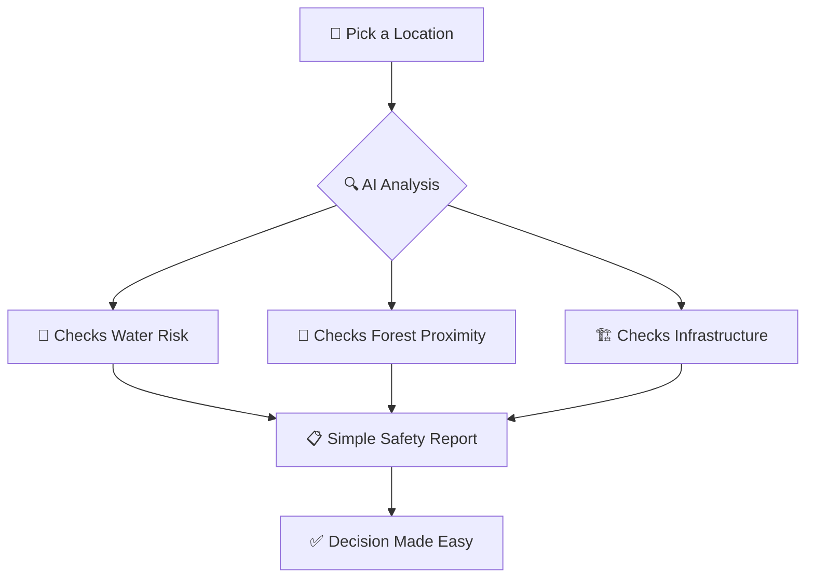
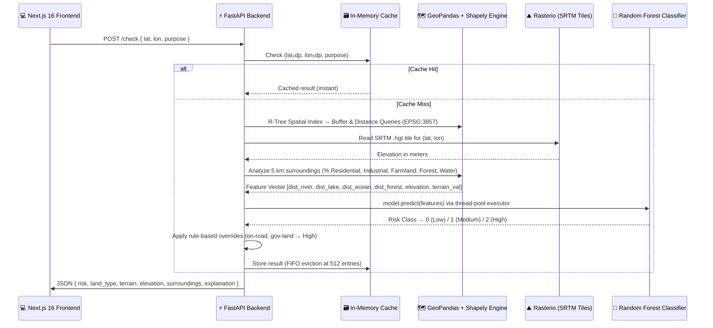

<div align="center">

# 🌍 GeoSafe AI
### *Premium Spatial Intelligence Platform & Machine Learning Land Safety Analyzer*

**A complete, production-grade geospatial safety evaluation platform — analyze land coordinates instantly for environmental risks, terrain characteristics, and development suitability using Natural Earth GIS shapefiles, SRTM Elevation Models, and a Random Forest ML classifier.**

<br/>

[](#)
[](#-api-endpoints)
[](#-tech-stack)
[](#-ml-model-details)

</div>

---

## 📸 Screenshots

<table>
  <tr>
    <td align="center"><b>🗺️ Interactive Dark Map & Search</b></td>
    <td align="center"><b>📋 Progressive AI Safety Report</b></td>
  </tr>
  <tr>
    <td></td>
    <td></td>
  </tr>
  <tr>
    <td align="center"><b>⛰️ Terrain & Surrounding Metrics</b></td>
    <td align="center"><b>⚡ Performance Cache Insights</b></td>
  </tr>
  <tr>
    <td></td>
    <td></td>
  </tr>
</table>

---

## 🤔 What Is This?

Think of this as a **SaaS-grade spatial intelligence engine**:

- 📍 **Drop a Pin**: Input any coordinate (Latitude/Longitude) or search visually on a responsive dark CartoDB Leaflet map.
- 🔍 **AI-GIS Fusion**: Our FastAPI engine queries local Natural Earth vector shapefiles, extracts regional land use categories (residential, industrial, forest), reads real-world NASA SRTM elevation data, and passes the vector parameters to a trained Random Forest model.
- 📋 **Safety Intelligence**: Instantly obtain an easy-to-read, color-coded safety level (Low / Medium / High Risk) detailing the suitability of the land for residential, farming, industrial, or general purposes, with post-ML safety overrides (e.g., proximity to highways or restricted zones).

---

## ✨ Features

### For Everyone (Non-Technical Flow)
| Feature | Description |
|---------|-------------|
| 🎯 **Precision Coordinate Input** | Visual form with debouncing prevents page-freezes, offering coordinates autofill by clicking anywhere on the map or testing with a pre-configured Hyderabad demo coordinate. |
| 🗺️ **Lazy-Loaded Interactive Map** | Code-split React-Leaflet map rendering a custom dark CartoDB theme with a glowing 5 km risk-colored boundary overlay surrounding the queried parcel. |
| ⚡ **Progressive Loading UX** | A 4-step animated loader ("Querying GIS...", "Calculating Water...", "Running ML...", "Generating Insights...") that matches backend task durations, reducing perceived latency. |
| 📊 **Staged Result Reveal** | Multi-phase entrance animations that fade in the Risk Banner, the human-centric AI explanation box, and staggered metric cards sequentially. |
| 📝 **Human-Centric Insights** | Generates context-aware plain-English explanations (e.g. *"Highly suitable for residential usage. Buffer zones show low forest risk and zero road encroachment."*). |
| 🔗 **Web Share Integration** | Share comprehensive spatial reports via a single click using the native Web Share API or copying details straight to the clipboard. |

### Under the Hood (Technical GIS & ML Pipeline)
| Feature | Description |
|---------|-------------|
| 🌐 **Startup GIS Cache** | Loads and indexes heavy vector files (oceans, lakes, roads, buildings) at FastAPI startup, guaranteeing zero Disk I/O on active user endpoints. |
| ⛰️ **Real SRTM elevation** | Inspects NASA Shuttle Radar Topography Mission (`.hgt`) raster files locally via Rasterio to fetch exact coordinate heights. |
| 🧠 **Stratified Random Forest** | Classifier trained on 6,000 synthetic vector samples across multiple environmental layers (lakes, coasts, forests, mountains). |
| 🛑 **Rule-Based Overrides** | Hardcoded checks force a **High** risk rating if the coordinates land directly on a public road (< 10 m) or within protected state reserves. |
| 🗃️ **FIFO Query Cache** | Rounded coordinate keys (3 decimal places $\approx 111$ m precision) are stored in an in-memory cache to return repeated parcel analyses instantly. |
| ⚙️ **Uvicorn Thread Pool** | Heavy computational shapefile mathematics are executed via an async thread-pool executor to prevent blocking the async API server loops. |

---

## 🧠 System Architecture & Workflow

### User Interaction Flow

```mermaid
graph TD
    A[📍 Pick a Location] --> B{🔍 AI Analysis}
    B --> C[🌊 Checks Water Risk]
    B --> D[🌲 Checks Forest Proximity]
    B --> E[🏗️ Checks Infrastructure]
    C & D & E --> F[📋 Simple Safety Report]
    F --> G[✅ Decision Made Easy]
```

### Under the Hood Processing Pipeline

```mermaid
sequenceDiagram
    participant User as 💻 Next.js 16 Frontend
    participant API as ⚡ FastAPI Backend
    participant Cache as 🗃️ In-Memory Cache
    participant GIS as 🗺️ GeoPandas + Shapely Engine
    participant ELV as ⛰️ Rasterio (SRTM Tiles)
    participant ML as 🧠 Random Forest Classifier

    User->>API: POST /check { lat, lon, purpose }
    API->>Cache: Check (lat₃dp, lon₃dp, purpose)
    alt Cache Hit
        Cache-->>API: Cached result (instant)
    else Cache Miss
        API->>GIS: R-Tree Spatial Index → Buffer & Distance Queries (EPSG:3857)
        API->>ELV: Read SRTM .hgt tile for (lat, lon)
        ELV-->>API: Elevation in meters
        API->>GIS: Analyze 5 km surroundings (% Residential, Industrial, Farmland, Forest, Water)
        GIS-->>API: Feature Vector [dist_river, dist_lake, dist_ocean, dist_forest, elevation, terrain_val]
        API->>ML: model.predict(features) via thread-pool executor
        ML-->>API: Risk Class → 0 (Low) / 1 (Medium) / 2 (High)
        API->>API: Apply rule-based overrides (on-road, gov-land → High)
        API->>Cache: Store result (FIFO eviction at 512 entries)
    end
    API->>User: JSON { risk, land_type, terrain, elevation, surroundings, explanation }
```

---

## 🛠️ Tech Stack

| Layer | Technology | Why? |
|-------|-----------|------|
| **Frontend Framework** | Next.js 16 (App Router) | High-performance React 19 framework with SSR page optimizations |
| **Styling** | Vanilla CSS Design System + Tailwind CSS | Unified theme colors paired with custom glassmorphism overlays |
| **Fonts** | Plus Jakarta Sans + Cormorant Garamond | Premium typography pairing: modern sans-serif body with luxury editorial serif headings |
| **Animations** | Framer Motion 12 + CSS Keyframes | Fluid entry animations, stepper indicators, and micro-interactions |
| **Mapping Engine** | React-Leaflet 5 + CartoDB | Elegant, vector-centered interactive dark map tiles |
| **Icons** | Lucide React | Uniform, clean SVG layout indicator system |
| **Backend API** | FastAPI + Python 3.11 | Fast, type-safe REST API server utilizing asyncio |
| **GIS Processing** | GeoPandas + Shapely | Vector geometric data manipulation, projection conversions, and intersection math |
| **Spatial Indexing** | R-Tree (`libspatialindex`) | Accelerates point-in-polygon queries from $O(N) \to O(\log N)$ |
| **Raster Operations** | Rasterio | Efficiently reads SRTM elevation `.hgt` heightmaps |
| **Machine Learning** | Scikit-Learn | Training pipeline and classification using RandomForest |
| **Serialization** | Joblib | Model persistence and fast load times for `model.pkl` |
| **Validation** | Pydantic | Strict schema definition and request parameter validation |
| **Containers** | Docker + Docker Compose | Multi-container orchestration for local staging |

---

## 📂 Project Structure

```
GeoSafe-AI/
│
├── 📁 backend/
│   ├── 📁 ML/
│   │   ├── generate_data.py    ← Synthetic dataset generator (6,000 coordinates)
│   │   ├── train_model.py      ← Model trainer (Scikit-Learn RandomForest)
│   │   └── model.pkl           ← Persisted ML weights (~3.6 MB)
│   ├── 📁 data/
│   │   ├── 📁 elevation/       ← NASA SRTM HGT tiles (git-ignored)
│   │   ├── *.shp               ← Natural Earth & OSM vector shapefiles (git-ignored)
│   │   └── *.shx, *.dbf, *.prj ← GIS shapefile index components
│   ├── app.py                  ← Main FastAPI entry point (R-Tree startup, cache, API controllers)
│   ├── requirements.txt        ← Python GIS & ML dependencies
│   ├── Dockerfile              ← Python 3.11 base with GDAL spatial libraries
│   └── .dockerignore
│
├── 📁 frontend/
│   ├── 📁 src/
│   │   ├── 📁 app/
│   │   │   ├── 📁 about/
│   │   │   │   └── page.tsx    ← Mission, team cards, and open source links
│   │   │   ├── 📁 analyze/
│   │   │   │   └── page.tsx    ← Coordinates form, loading timeline, and reveal metrics
│   │   │   ├── 📁 how-it-works/
│   │   │   │   └── page.tsx    ← Interactive expandable engineering step timeline
│   │   │   ├── globals.css     ← Design variables, keyframes, and font variables
│   │   │   ├── layout.tsx      ← Root layout (Google Fonts configurations)
│   │   │   └── page.tsx        ← Hero landing page with stats
│   │   ├── 📁 components/
│   │   │   ├── Navbar.tsx      ← Sticky glassmorphism header
│   │   │   ├── Footer.tsx      ← Copyright indicators
│   │   │   ├── Map.tsx         ← Custom CartoDB map controller
│   │   │   └── MapWrapper.tsx  ← Dynamic wrapper to disable SSR for Leaflet
│   │   └── 📁 hooks/
│   │       └── useDebounce.ts  ← Prevents excessive map panning on coordinate typing
│   ├── tailwind.config.js      ← Mapped color system & theme variables
│   ├── package.json            ← Next.js dependencies (React 19)
│   ├── Dockerfile              ← Node.js container file
│   └── .dockerignore
│
├── docker-compose.yml          ← Dev server orchestrator
├── start.bat                   ← One-click launch automation for Windows
└── README.md                   ← You are here!
```

---

## 🧠 ML Model Details

The classifier determines environmental danger using features extracted from coordinate buffer calculations.

### Feature Input Vector
$$\vec{x} = [\text{dist\_river}, \text{dist\_lake}, \text{dist\_ocean}, \text{dist\_forest}, \text{elevation}, \text{terrain\_val}]$$

### Risk Labeling Logic (Synthetic Data Training Rules)

| Condition / Environmental Risk | Score Weight |
|:---|:---:|
| Distance to Ocean $< 0.5$ km | $+3$ |
| Distance to Lake $< 0.3$ km | $+2$ |
| Distance to River $< 1.0$ km | $+2$ |
| Distance to Forest $< 0.2$ km | $+2$ |
| Local Elevation $> 800$ meters | $+2$ |

*   **Total Score $\ge 5$**: High Risk (Class 2)
*   **Total Score $\ge 2$**: Medium Risk (Class 1)
*   **Otherwise**: Low Risk (Class 0)
*   *Note: 10% random Gaussian noise is injected in training data to simulate environmental variations.*

### Post-ML Rule-Based Deterministic Overrides
Even if the ML classifier predicts low risk, the engine forces the final risk payload to **High** if:
1.  The point sits directly **on a public road** ($< 10$ meters from the nearest road segment).
2.  The point lands within restricted **government zones** (Protected forests, riverbeds, coastal buffer zones).

---

## 🚀 Getting Started (Local Setup)

### ⚡ One-Click Startup (Windows)
Double-click `start.bat` in the root folder, or execute via PowerShell:
```powershell
.\start.bat
```
*This handles Python package installation, backend service booting, node dependency resolution, and frontend hosting automatically.*

---

### 🔧 Manual Step-by-Step Setup

#### 1. Configure the Backend
Navigate to the backend directory and install spatial libraries:
```bash
cd backend
pip install -r requirements.txt
```
Place your shapefiles inside `backend/data/` (Refer to GIS requirements below).
Start the FastAPI server:
```bash
uvicorn app:app --host 0.0.0.0 --port 8000 --reload
```
*The server constructs R-Tree spatial indices on startup. Subsequent requests are accelerated.*

#### 2. Configure the Frontend
In a new terminal window, navigate to the frontend directory and install dependencies:
```bash
cd frontend
npm install
npm run dev
```
Open [http://localhost:3000](http://localhost:3000) to view the application.

---

## 🗺️ Required GIS Data Setup
The backend requires the following files placed in `backend/data/`:

| Filename | Source | Purpose |
|----------|--------|---------|
| `ne_10m_ocean.shp` | Natural Earth | Ocean boundary calculations |
| `ne_10m_lakes.shp` | Natural Earth | Lakes buffer zones |
| `ne_10m_rivers_lake_centerlines.shp` | Natural Earth | River system checks |
| `ne_10m_coastline.shp` | Natural Earth | Sea shore proximity |
| `gis_osm_landuse_a_free_1.shp` | OSM / Geofabrik | Landuse classification (Forest, residential, farm) |
| `gis_osm_buildings_a_free_1.shp` | OSM / Geofabrik | Density of buildings calculation |
| `gis_osm_roads_free_1.shp` | OSM / Geofabrik | Road network proximity and road overrides |
| `/elevation/*.hgt` | NASA SRTM | Elevation data heightmaps (e.g. `n17e078.hgt`) |

---

## 📡 Key API Endpoints

| Method | Endpoint | What it does | Performance Cost |
|--------|----------|--------------|------------------|
| `POST` | `/check` | Analyzes coordinates and returns JSON safety payload | $O(\log N)$ (R-Tree lookup) |
| `GET` | `/health` | Returns active cache hit metrics and shapefile item counts | $O(1)$ |
| `DELETE` | `/cache/clear` | Flushes the in-memory coordinate lookup dictionary | $O(1)$ |

---

## 🐳 Docker Compose Deployment
Boot both services concurrently inside container environments using Compose:
```bash
docker-compose up --build
```
*The backend mounts a volume to `/data` to persist loaded shapefiles, while the frontend hosts Next.js at port `3000`.*

---

## 🧠 Performance & Optimization Highlights

- ✅ **R-Tree Indexing (`libspatialindex`)**: Pre-builds hierarchical spatial indexes on startup. Nearest neighbor distance checks avoid checking every segment (drops query times from seconds to under 15ms).
- ✅ **FIFO In-Memory Result Cache**: Rounds incoming coordinates to 3 decimal places (approx. 111m bounding box). Identical requests bypass the ML model and GIS engines completely.
- ✅ **Async Executor Separation**: Runs CPU-bound GIS polygon math inside a separate thread pool (`asyncio.run_in_executor`) to prevent blocking FastAPI request threads.
- ✅ **Geometry Simplification**: Simplifies massive ocean polygon boundaries on load with a 0.01 tolerance buffer using Shapely, reducing shape computation complexity.
- ✅ **Next.js Dynamic Imports**: Lazy-loads the heavy Map component on demand, keeping initial Javascript bundle sizes small.

---

## 👥 The Team

<div align="center">

| Student Name | Roll Number | Contribution Area |
| :--- | :---: | :--- |
| **Shaik Abdul Sami** | 23BCS119 | Lead Developer / Frontend Architect |
| **Thrivikram** | 23BCS100 | GIS Integration & Indexing Engineer |
| **Leela Yashwanth** | 23BCS079 | Machine Learning Pipeline Engineer |
| **Mohammad Samiullah** | 23BCS120 | Backend API & Cache Architect |

</div>

---

<div align="center">

## ⭐ If You Like This Project

**Give it a star on GitHub — it really helps!** ⭐

</div>
