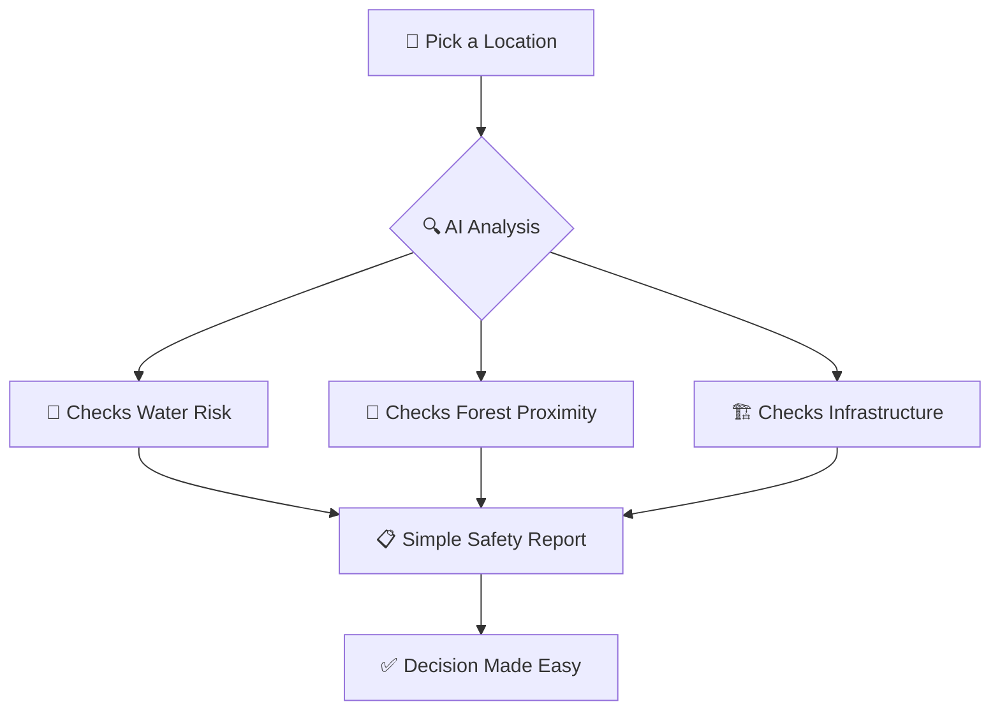
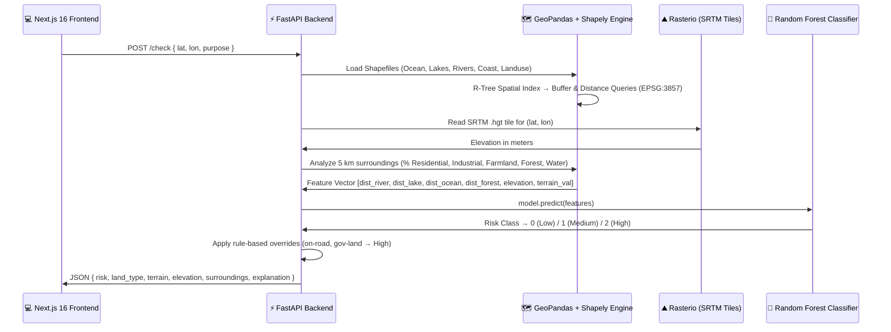

# 🌍 GeoSafe AI — Smart Land Safety Analyzer

> **Transforming Complex Spatial Data into Actionable Safety Insights.**

GeoSafe AI is a spatial intelligence platform that evaluates land safety, environmental risks, and developmental suitability for any coordinate. It combines **Natural Earth GIS data**, **OpenStreetMap shapefiles**, **SRTM Elevation Models**, and a **Random Forest ML classifier** to produce a risk score (Low / Medium / High) along with plain-English explanations.

---

## 📊 System Workflows

### 🛡️ For Everyone (Non-Technical Flow)
*Understanding how GeoSafe AI helps you make safer decisions.*


```mermaid
graph TD
    A[📍 Pick a Location] --> B{🔍 AI Analysis}
    B --> C[🌊 Checks Water Risk]
    B --> D[🌲 Checks Forest Proximity]
    B --> E[🏗️ Checks Infrastructure]
    C & D & E --> F[📋 Simple Safety Report]
    F --> G[✅ Decision Made Easy]
```

### ⚙️ Under the Hood (Technical Pipeline)
*The architecture powering our spatial intelligence.*


```mermaid
sequenceDiagram
    participant User as 💻 Next.js 16 Frontend
    participant API as ⚡ FastAPI Backend
    participant GIS as 🗺️ GeoPandas + Shapely Engine
    participant ELV as ⛰️ Rasterio (SRTM Tiles)
    participant ML as 🧠 Random Forest Classifier

    User->>API: POST /check { lat, lon, purpose }
    API->>GIS: Load Shapefiles (Ocean, Lakes, Rivers, Coast, Landuse)
    GIS->>GIS: R-Tree Spatial Index → Buffer & Distance Queries (EPSG:3857)
    API->>ELV: Read SRTM .hgt tile for (lat, lon)
    ELV->>API: Elevation in meters
    API->>GIS: Analyze 5 km surroundings (% Residential, Industrial, Farmland, Forest, Water)
    GIS->>API: Feature Vector [dist_river, dist_lake, dist_ocean, dist_forest, elevation, terrain_val]
    API->>ML: model.predict(features)
    ML->>API: Risk Class → 0 (Low) / 1 (Medium) / 2 (High)
    API->>API: Apply rule-based overrides (on-road, gov-land → High)
    API->>User: JSON { risk, land_type, terrain, elevation, surroundings, explanation }
```

---

## ✨ Key Features

| Feature | Description |
| :--- | :--- |
| **🎯 Precision Analysis** | Evaluates land against multiple spatial layers — Ocean, Lakes, Rivers, Coast, Forest, Farmland, Residential, and Industrial zones. |
| **🧠 ML-Powered Risk Scoring** | Random Forest classifier (200 trees, max depth 12) trained on 6 000 synthetic spatial data points with stratified splitting. |
| **⛰️ Terrain Awareness** | Reads real SRTM `.hgt` elevation tiles via Rasterio. Classifies terrain as **Plain** (≤ 300 m), **Hill** (301–800 m), or **Mountain** (> 800 m). |
| **🗺️ Interactive Map** | Click-to-select location on a dark CartoDB basemap via Leaflet + React-Leaflet, with a risk-colored 5 km radius overlay. |
| **📊 Surrounding Breakdown** | Calculates the percentage of Residential, Industrial, Farmland, Forest, Water, and Open/Unclassified land within a 5 km radius. |
| **🔒 Government Land Detection** | Flags roads, forests, water bodies, river zones, and coastal zones as restricted government land. |
| **📝 Human-Centric Insights** | Generates purpose-aware explanations (e.g., *"Suitable for residential usage. Surrounding area implies compatibility."*). |
| **🔗 Share Results** | One-click share or copy-to-clipboard for the analysis report. |

---

## 🛠️ Tech Stack

| Layer | Technology | Version | Purpose |
| :--- | :--- | :--- | :--- |
| **Frontend** |  | 16.2.4 | App Router, SSR, TypeScript pages |
| **UI Framework** |  | 19.2.4 | Component rendering |
| **Styling** |  | 3.4.1 | Utility-first CSS |
| **Animations** |  | 12.38.0 | Page transitions & micro-animations |
| **Mapping** |  | 1.9.4 | Interactive map (React-Leaflet 5.0) |
| **Icons** |  | 1.11.0 | SVG icon system |
| **Backend** |  | latest | Async REST API (`POST /check`) |
| **Spatial** |  | latest | Vector data processing & spatial joins |
| **Geometry** |  | latest | Point, buffer, distance operations |
| **Elevation** |  | latest | Reading SRTM `.hgt` elevation tiles |
| **ML Engine** |  | latest | RandomForestClassifier training & inference |
| **Serialization** |  | latest | Model persistence (`model.pkl`) |
| **Validation** |  | latest | Request body validation |
| **Language** |  | 5.x | Frontend type safety |
| **Containers** |  | — | Docker Compose multi-service orchestration |

---

## 🚀 Getting Started

### Prerequisites

- **Python** 3.11+
- **Node.js** 20+
- **GIS Data**: Place Natural Earth shapefiles and OSM shapefiles inside `backend/data/` (see [Data Setup](#-data-setup))

### ⚡ One-Click Start (Windows)

```powershell
.\start.bat
```

This script:
1. Installs Python dependencies (`pip install -r requirements.txt`)
2. Launches the **backend** on `http://localhost:8000`
3. Waits 5 seconds, then installs Node dependencies (`npm install`)
4. Launches the **frontend** on `http://localhost:3000`

### 🔧 Manual Setup

#### 1. Backend (FastAPI + Python)

```bash
cd backend
pip install -r requirements.txt
uvicorn app:app --host 0.0.0.0 --port 8000 --reload
```

#### 2. Frontend (Next.js 16 + TypeScript)

```bash
cd frontend
npm install
npm run dev
```

### 🐳 Docker Compose

```bash
docker-compose up --build
```

This brings up two services:

| Service | Port | Image Base |
| :--- | :--- | :--- |
| `backend` | `8000` | `python:3.11-slim` + GDAL + spatial libs |
| `frontend` | `3000` | `node:20-alpine` |

> The frontend connects to the backend via `NEXT_PUBLIC_API_URL=http://localhost:8000`.

---

## 📦 Data Setup

The backend expects the following GIS files inside `backend/data/`:

| File | Source | Purpose |
| :--- | :--- | :--- |
| `ne_10m_ocean.shp` | [Natural Earth](https://www.naturalearthdata.com/) | Ocean polygons |
| `ne_10m_lakes.shp` | Natural Earth | Lake polygons |
| `ne_10m_rivers_lake_centerlines.shp` | Natural Earth | River lines |
| `ne_10m_coastline.shp` | Natural Earth | Coastline lines |
| `gis_osm_landuse_a_free_1.shp` | [Geofabrik OSM](https://download.geofabrik.de/) | Land use zones (Residential, Industrial, Farmland, Forest) |
| `gis_osm_buildings_a_free_1.shp` | Geofabrik OSM | Building footprints (for density) |
| `gis_osm_roads_free_1.shp` | Geofabrik OSM | Road network |
| `elevation/*.hgt` | [SRTM / NASA](https://earthexplorer.usgs.gov/) | Elevation tiles (e.g., `n17e078.hgt`) |

> These files are excluded from Git via `.gitignore`. Download and place them manually.

---

## 🧠 ML Model Details

| Parameter | Value |
| :--- | :--- |
| Algorithm | `RandomForestClassifier` |
| Estimators | 200 |
| Max Depth | 12 |
| Min Samples Split | 5 |
| Training Samples | 6 000 (synthetically generated from real GIS data) |
| Train/Test Split | 80 / 20 (stratified) |
| Feature Vector | `[dist_river, dist_lake, dist_ocean, dist_forest, elevation, terrain_val]` |
| Output Classes | `0` → Low, `1` → Medium, `2` → High |

### Risk Labeling Logic (Training Data)

| Condition | Score |
| :--- | :--- |
| Distance to ocean < 0.5 km | +3 |
| Distance to lake < 0.3 km | +2 |
| Distance to river < 1 km | +2 |
| Distance to forest < 0.2 km | +2 |
| Elevation > 800 m | +2 |
| **Total ≥ 5** → High (2) | **Total ≥ 2** → Medium (1) | **Otherwise** → Low (0) |

> 10% random noise is injected during training to improve generalization.

### Post-ML Rule-Based Overrides

The final risk is forced to **High** if:
- The location is directly **on a public road**
- The location falls in a **government-restricted zone** (Forest, Water Body, River Zone, Coastal Zone)

---

## 🌐 API Reference

### `POST /check`

**Request Body:**
```json
{
  "lat": 17.385,
  "lon": 78.4867,
  "purpose": "Residential"
}
```

| Field | Type | Required | Description |
| :--- | :--- | :--- | :--- |
| `lat` | float | ✅ | Latitude (WGS84) |
| `lon` | float | ✅ | Longitude (WGS84) |
| `purpose` | string | ❌ | One of: `General`, `Residential`, `Industrial`, `Farming`. Defaults to `""`. |

**Response:**
```json
{
  "risk": "Low",
  "purpose": "Residential",
  "land_type": "Residential",
  "terrain": "Plain",
  "elevation": 542.0,
  "building_density": 23,
  "res_pct": 15.2,
  "ind_pct": 3.1,
  "farm_pct": 8.0,
  "forest_pct": 0.0,
  "water_pct": 0.5,
  "other_pct": 73.2,
  "on_road": false,
  "near_road": true,
  "nearby_roads_count": 12,
  "gov_land": false,
  "gov_type": "Private",
  "explanation": "Residential land. Nearby → Residential:15.2% ... Suitable for Residential usage."
}
```

---

## 📂 Project Structure

```text
GeoSafe-AI/
├── 📂 backend/                          # Python FastAPI service
│   ├── app.py                           # Main API (POST /check endpoint)
│   ├── requirements.txt                 # Python deps (fastapi, geopandas, scikit-learn, rasterio, etc.)
│   ├── Dockerfile                       # python:3.11-slim + GDAL + spatial libs
│   ├── .dockerignore
│   ├── 📂 ML/                           # Machine Learning pipeline
│   │   ├── generate_data.py             # Synthetic training data generator (6000 samples)
│   │   ├── train_model.py               # Model training script (RandomForest)
│   │   ├── big_data.csv                 # Generated training dataset
│   │   ├── model.pkl                    # Trained model (serialized via Joblib)
│   │   └── 📂 data/
│   │       └── model.pkl                # Alternate model copy
│   └── 📂 data/                         # GIS datasets (git-ignored)
│       ├── ne_10m_ocean.shp             # Natural Earth ocean
│       ├── ne_10m_lakes.shp             # Natural Earth lakes
│       ├── ne_10m_rivers_lake_centerlines.shp
│       ├── ne_10m_coastline.shp         # Coastline
│       ├── gis_osm_landuse_a_free_1.shp # OSM landuse
│       ├── gis_osm_buildings_a_free_1.shp
│       ├── gis_osm_roads_free_1.shp
│       └── 📂 elevation/               # SRTM .hgt tiles
│           └── *.hgt
│
├── 📂 frontend/                         # Next.js 16 TypeScript app
│   ├── package.json                     # next@16.2.4, react@19.2.4, leaflet, framer-motion
│   ├── next.config.ts
│   ├── tsconfig.json
│   ├── tailwind.config.js
│   ├── postcss.config.mjs
│   ├── Dockerfile                       # node:20-alpine
│   ├── .dockerignore
│   └── 📂 src/
│       ├── 📂 app/
│       │   ├── layout.tsx               # Root layout (Inter font, dark mode, Navbar + Footer)
│       │   ├── page.tsx                 # Home / Landing page (Hero, Stats, Features, Use Cases)
│       │   ├── globals.css
│       │   ├── 📂 analyze/
│       │   │   └── page.tsx             # Main analysis page (form, map, results dashboard)
│       │   ├── 📂 how-it-works/
│       │   │   └── page.tsx             # 4-step technical pipeline walkthrough
│       │   └── 📂 about/
│       │       └── page.tsx             # Team, tech stack, GitHub CTA
│       └── 📂 components/
│           ├── Navbar.tsx               # Fixed nav with glassmorphism
│           ├── Footer.tsx               # Copyright + links
│           ├── Map.tsx                  # Leaflet map (CartoDB dark tiles, click-to-select, risk circle)
│           └── MapWrapper.tsx           # Dynamic import wrapper (SSR disabled for Leaflet)
│
├── docker-compose.yml                   # Multi-service orchestration (backend + frontend)
├── start.bat                            # Windows one-click launcher
├── .gitignore                           # Excludes data/, shapefiles, node_modules, .env
└── README.md
```

---

## 📄 Frontend Pages

| Route | Page | Description |
| :--- | :--- | :--- |
| `/` | Home | Hero section, stats (90%+ accuracy, 3 risk levels, 10+ GIS layers, < 2s analysis), 3-step process, 6 features, 4 use cases. |
| `/analyze` | Analyze | Coordinate input form, purpose selector (General / Residential / Industrial / Farming), interactive Leaflet map, real-time AI results dashboard with risk banner, explanation, and environmental metrics. |
| `/how-it-works` | How It Works | 4-step animated timeline (User Input → GIS Extraction → ML Classifier → Risk Output) with expandable technical details. |
| `/about` | About | Project story, tech stack cards (Frontend / Backend / ML), team section, GitHub CTA. |

---

## 👥 The Team

| Name | Roll No. |
| :--- | :--- |
| Abdul Sami | 23BCS119 |
| Thrivikram | 23BCS100 |
| Leela Yashwanth | 23BCS079 |
| Mohammad Samiullah | 23BCS120 |

---

<p align="center">Built with ❤️ for a Safer Planet.</p>
